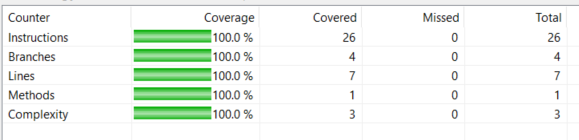

****SENG 438 - Software Testing, Reliability, and Quality****

  

****Lab. Report** #3 – Code Coverage, Adequacy Criteria and Test Case Correlation**

  

| Group \#21:  | |

| -------------- | --- |

| Student Names: | |

| Brian Nguyen  | |

| Dimitar Janevski | |

| Ideen Banijamali | |

| Javier Capobianco | |

 

# 1 Introduction

This report demonstrates the different strategies Group 21 used when testing the Range class and DataUtilities class. Some of our strategies involved equivalence class testing, boundary value analysis and stubs/mocking. This lab focused more on the mocking strategy since the DataUtilities class depends on external classes. We are only testing the classes mentioned above so we must set up a mocking environment that does not depend on other classes' functionality. Equivalence class testing was used in order to reduce the number of test cases per method we needed to do as this strategy groups inputs that result in the same behavior of the program and boundary analysis was used to test the behavior of the boundaries of the equivalence classes. Overall, this report provides insight into the thorough and comprehensive testing approach taken by our group for the Range and DataUtilities classes.

# 2 Manual data-flow coverage calculations for X and Y methods

**calculateColumnTotal():**
Data Flow Graph + Def-Use Sets Per Statement:

DU-Pairs Per Variable:

| **defs**         | def(1) = {total} def(3) = {total} def(4) = {rowCount} def(5) = {v} def(7) = {row} def(9x) = {n} def(11) = {total} def(12) = {v}           |
|--------------    |------------------------------------------------------------------------------------------------------------------------------------------------------------    |
| **uses**         | use(2) = {total} use(6) = {v} use(7) = {v} use(8) = {row, rowCount} use(9) = {row} use(10) = {n} use(11) = {n} use(13) = {total}          |
| **du-pairs**     | for total: (1,2), (1,13), (3,13), (11,13) for rowCount: (4,8) for v: (5,6), (5,7), (12,6), (12,7) for row: (7,8), (7,9) for n: (9,10), (9,11)      |

<u>Covered Pairs Per Test Case:</u>
| **Test Case**                                                     | **Covered Pair**                                                                              |
|---------------------------------------------------------------    |-------------------------------------------------------------------------------------------    |
| calculateColumnTotalWithNullData                                  | n/a                                                                                           |
| calculateColumnTotalWithValidDataAndValidColumn                   | (1,2), (1,13), (11,13), (4,8), (5,6), (5,7), (12,6), (12,7), (7,8), (7,9), (9,10), (9,11)     |
| calculateColumnTotalWithValidDataAndPositiveOutOfBoundsColumn     | (1,2), (1,13), (4,8), (5,6), (5,7), (12,6), (12,7), (7,8), (7,9), (9,10)                      |
| calculateColumnTotalWithValidDataAndNegativeOutOfBoundsColumn     | (1,2), (1,13), (4,8), (5,6), (5,7), (12,6), (12,7), (7,8), (7,9), (9,10)                      |

<u>DU-Pair Coverage Calculation:</u>
Total number of du pairs: 13
Number of infeasible du pairs: 1 ( (3,13) as total will never be greater than 0 right after being declared as 0)
Covered du pairs: 12

**contains():**
Data Flow Graph + Def-Use Sets Per Statement:

DU-Pairs Per Variable:
| value          | (1, 2) (1, 3) (1, 4)     |
|------------    |----------------------    |
| this.lower     | (1,2) (1,4)              |
| this.upper     | (1,3) (1,4)              |

Covered Pairs Per Test Case:
| **Test Case**                  | **Covered Pair**         |
|----------------------------    |----------------------    |
| containsTestPositiveRange      | (1, 2) (1, 3) (1, 4)     |
| containsTestNegativeRange      | (1, 2) (1, 3) (1, 4)     |
| containsTestValueAbove         | (1, 2) (1, 3)            |
| containsTestValueBelow         | (1, 2)                   |
| containsTestValueInside        | (1, 2) (1, 3) (1, 4)     |
| containsTestValueLeftEdge      | (1, 2) (1, 3) (1, 4)     |
| containsTestValueRightEdge     | (1, 2) (1, 3) (1, 4)     |

# 3 A detailed description of the testing strategy for the new unit test

We will go through each method that has a low coverage percentage, and review the source code and see what the coverage on each line is (by using EclEmma). The lines that have not been covered will show up in red and thus we will know which lines the test have not covered. After figuring out which statements have not been covered we will add test cases that will make the program go through the non-covered lines. And if the lines show up highlighted in yellow, we will check which conditions it has covered and which conditions it has not and update or add tests relating to those conditions.

# 4 A high level description of five selected test cases you have designed using coverage information, and how they have increased code coverage

We based the five test cases that we wrote based on the current coverage information from Assignment 2. When we checked the coverage, we noticed that some methods did not have a minimum of: 90% statement coverage, 70% branch coverage, and 60% condition coverage. Thus, we designed our 5 selected test cases based on meeting the criteria required.

1.  Range Class - constrainValueBelowLowerBound():  
    - Initially, this class did not have 100% line coverage since we did not account for a lower bound when checking for values in a range.  
    - By adding a test case that accounts for the lower bound, we were able to increase the line coverage up to 100%.
    
2.  Range Class - combineOneNullRange():  
    - Initially, this class did not have 100% branch, line, or instruction coverage. We did not account for null values so we skipped both if statements at the beginning of the method.  
    - By adding a test case that accounts for combining a valid range with a null range, values, we were able to increase the line, branch and instruction coverage.
    
3.  Range Class - combineTwoNullRanges():  
    - Initially, this class did not have 100% branch, line, or instruction coverage. We did not account for null values so we skipped both if statements at the beginning of the method.  
    - By adding a test case that accounts for combining two null values, we were able to achieve 100% coverage for all metrics.
    
4.  DataUtilities Class - getCumulativePercentagesNullArray():  
    - Initially, this class did not reach the minimum requirements for branch, line or instruction coverage. This is because we did not account for KeyedValues containing null values. The method checked for null values on lines 6 & 7, and on lines 19 & 20.  
    - By creating tests for null KeyedValues, we were able to increase the branch, line and instruction coverage.
    
5.  Range Class - expandRangeTestNullValuePos():  
    - Initially, this class did not reach the minimum requirements for branch, line, or instruction coverage. We did not test the case where we could have a currentrange that is null and expand to include any number.  
    - By creating a test case where we use expandToInclude(null, x), where x is any number, we were able to increase our branch, line and instruction coverage.

# 5 A detailed report of the coverage achieved of each class and method (a screen shot from the code cover results in green and red color would suffice)

**Range Class:**
static Range combine(Range, Range)
 

 

 
boolean constrain(double)
 

 

 
boolean intersects(double, double)
 

 

 
static Range expandToInclude(Range, double)
 

 

 
boolean contains(double)
 

 

 

**Data Utilities class:**
static Number[] createNumberArray(double [])
 

 

 
static Number[] createNumberArray(double [][])
 

 

 
static KeyedValues getCumulativePercentages(KeyValues)
 

 

 
We could not get above 90% statement coverage since this method has a for loop that will never be run because of how it is written, this loop will always get a false condition and thus it is impossible to run the statements inside the for loop.
 
static double calculateColumnTotal(Values2D, int)
 

 

 
We could not get above 90% statement coverage since this method has a for loop that will never be run because of how it is written, this loop will always get a false condition and thus it is impossible to run the statements inside the for loop. 
 
static double calculateRowTotal(Values2D, int)
 

 

 
We could not get above 90% statement coverage since this method has a for loop that will never be run because of how it is written, this loop will always get a false condition and thus it is impossible to run the statements inside the for loop. 

# 6 Pros and Cons of coverage tools used and Metrics you report

Group 21 used EclEmma as a coverage tool with the eclipse IDE. The installation process of the coverage tool was very simple, and in fact the eclipse IDE has a client marketplace that has support for EclEmma. With EclEmma at the click of a button we can cover the test suite very easily. The coverage reports on instructions, branches. lines, methods, complexity. This tool was very easy to learn and there's a lot of documentation online that explains what each highlight means and what each coverage criteria actually refers to. We experienced 0 crashes with this tool when we used it and the ease of use was very high for EclEmma. However, the big disadvantage with EclEmma is that it supports method coverage instead of condition coverage. 

# 7 A comparison on the advantages and disadvantages of requirements-based test generation and coverage-based test generation.

Requirement-based test generation focuses on generating test cases based on pre-defined requirements and how well the code can fulfill them. In contrast, coverage-based test generation focuses on developing tests to cover as much of the code itself as possible.

A benefit of requirements-based testing is that it provides an effective way to ensure the software requirements are fulfilled and catch any related errors early in the development process. However, this method may miss bugs in the code which are not directly related to specific requirements. It also requires that there are complete and accurate requirements defined beforehand. It can also be a time-consuming and therefore costly process.

Coverage-based testing, on the other hand, can detect errors in the code which may not have been detailed in the requirements and provides a quantifiable measure of code coverage which can be useful in determining the comprehensiveness of the tests as well as areas that may lack testing. Additionally, it can be automated which will save time and money. While being able to detect flaws not related to requirements is an advantage, coverage-based testing may fail to ensure the requirements are actually met. Additionally, it can be difficult to achieve high coverage and may result in over testing for larger systems.

# 8 A discussion on how the team work/effort was divided and managed

The first part of the assignment was getting our testing environments set up and understanding the assignment. This was done in a group setting so that we could ensure we all got started on the right foot and we all understood the assignment before splitting up the work. Then we split up into pairs; one pair was responsible for the manual code coverage process, while the other pair was responsible for running the code coverage tools and developing the additional tests. We collectively decided on a test plan and reviewed our results and progress along the way.

# 9 Any difficulties encountered, challenges overcome, and lessons learned from performing the lab

A few difficulties we encountered was understanding the different types of coverage since a lot of them sounded similar initially. For example, most of our group members were struggling to understand the difference between condition-coverage and branch coverage. We spent time researching together from the notes and the internet to better understand the difference before implementing them in our test suites. 

  

# 10 Comments/feedback on the lab itself

This assignment was very valuable as it allowed us to learn about different types of coverage in an interactive manner. Visualizing the coverage and being able to modify test functions directly to see the results was a very good way to further our understanding of coverage-based testing methods. However, we thought that the instructions could have been a little more specific. As well, it was impossible to attain 90% coverage in certain methods.

